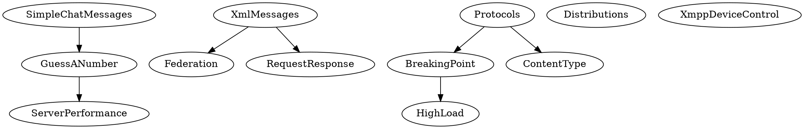

TODO
========

Features
-------------

[x] Events
	[x] Stochastic events
	[x] External events
	[x] Trigger activities
	[x] Guards
	[x] Clocks
[x] Meta-data
	[x] Title
	[x] Description
	[x] Script
	[x] Section descriptions
[x] Activities
	[x] Populations
	[x] Execution
	[x] Activity node with external event conditions, or stochastic conditions
		[x] Wait element (cf. Conditional)
		[x] Trigger event
		[x] Timeout (cf. Otherwise)
		[x] Call activity
	[x] Counters
	[x] Stat activity node: Increments counters
	[x] Measurements
	[x] Performance counters
	[x] CPU/Memory
	[x] Global variables
	[x] Timing of, and between events/activities. (communication roundtrip)
	[x] Actor variables
	[x] Filter sampled values, removing outliers
[x] Simulation output
	[x] Statistics
		[x] Activities
		[x] Actions
		[x] Events
		[x] Counters
		[x] Histograms
		[x] Mean, stddev, var, min, max
		[x] Errors, Exceptions (from Log)
		[x] Event type histogram over time
		[x] Custom SQL
	[x] Charts
		[x] History charts
		[x] Use case charts
		[x] Distribution (expected) charts
		[x] Custom comparison graphs (between counters/samples/etc)
	[x] Data as XML
	[x] Report as Markdown
		[x] Distributions
		[x] Models
		[x] Activity charts
		[x] Statistics
		[x] Custom graphs
		[x] Event log statistics
	[x] Commandline in report
	[x] epsilon measurement
[ ] Distributions
	[ ] Script-based PDF and CDF
	[ ] Arcsine distribution
	[ ] Beta distribution
	[x] Chi distribution
	[x] Chi-squared distribution
	[x] Exponential distribution
	[x] Gamma distribution
	[ ] Student-t distribution
	[ ] Cyclic distributions (specify modulus, example: weekly, monthly, etc.)
[x] Generate action documentation (xml, xslt) automatically
[ ] XMPP
	[x] Message handlers
	[x] Iq handlers
	[x] Presence handlers
	[x] Extension libraries
	[ ] UDP
	[x] Iq action node
	[x] Message action node
	[x] Presence action node
	[ ] PubSub action node
	[ ] PEP action node
[x] HTTP
	[x] GET
	[x] POST
		[x] String
		[x] JSON
		[x] Xml
		[x] Signed XML
[x] MQTT
	[x] PUBLISH
	[x] SUBSCRIBE
[ ] Decoupling ComSim.exe from plugin assembly dlls.

Examples
--------------

[x] Simple chat
[x] Guess a number
[x] Web Server Load (HTTP GET)
[x] Timing of communication roundtrip
[x] Parallel threads in activity
[x] Protocols comparison
[x] Breakpoint example
[x] Federation
[x] High load
[x] Performance comparison XML vs. JSON over MQTT
[x] Req/Resp pattern
[ ] State machines & External events to determine activity node transitions
[ ] Pub/Sub pattern
[ ]	Sensor data (local/remote)
[ ] Legal identities
[ ] Payments

Documentation
--------------------

[ ] Structure of a simulation file
[ ] TimeBase, TimeUnit, TimeCycle, Duration (cyclic time)
[ ] Explain keys

Dispelling networking myths using simulation
